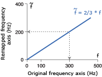

## Spectral remapping of natural signals
### Md. Shoaibur Rahman
### Department of Neuroscience, Baylor College of Medicine, Houston, TX 77054
#### Email: shoaibur@bcm.edu
  
### 1. Introduction

This paper presents an algorithm to procedurally remap spectral contents of natural signals. Procedural remapping of natural signals’ spectra is of interest in numerous applications. For example, computer music composers are interested in pitch transposition by modifying spectra of a wide variety of sound signals. Systematic pitch transpositions could produce many of our desired perceptual effects of sound signals. To achieve these perceptual effects, efficient remapping of spectral contents of sound signals has been a great importance in audio applications for a long time (Grey and Moorer, 1977; Grey and Gordon, 1978; Samson et al., 1997; Krumhansl and Iverson, 1992; Alluri and Toiviainen, 2010; Vos and Rasch, 1881; Deutsch, 2013). Analogous applications of spectral remapping have been reported in other fields as well. For instance, clinical applications using EEG (Chemin et al. 2018; Wang et al. 2016) and fMRI (Meszlényi et al. 2017), Acoustic oceanographic measurements (Niu et al. 2014; Bonnel et al. 2017), speech recognition (Chang et al., 2017; Goupell et al., 2008; Noda, 1988; Lee and Rose, 1998).

The process of spectral remapping is equivalent to warping of each frequency in the signal. So, spectral remapping can be achieved by warping each frequency of the signal based on a given remapping function (**Fig. 1**). The idea of frequency warping was initially proposed in terms of phase vocoders (Flanagan and Golden, 1966; Moorer 1978).  Phase vocoder was originally developed for timescale modification of audio, and was implemented using filter-banks and Fourier transforms (Dolson, 1986). Then other versions of phase vocoders were reported (Puckette, 1995; Laroche and Dolson, 1999). Although the implementation techniques of the later versions were different from the initial ones, the goal was same – to change the temporal characteristics of a sound by stretching or compressing the time-base of the spectrogram. These methods introduce errors in the spectral remapping process (Puckette and Brown, 1998). Further efforts had been made to develop more general methods for frequency warping, for instance, using arbitrary allpass maps (von Schroeter, 1999), and more recently, using short time Fourier transforms and Gabor frames (Evangelista and Cavaliere, 2007; Mejstrik and Evangelista, 2016; Wabnik et al., 2005). These methods perform well for remapping spectral contents of simple signals like pure tones or even frequency sweeps. However, these algorithms are susceptible to high spectral leakage during the remapping process for complex natural signals like human speech.

  Figure 1. Frequency remapping explained with a remapping function, ~f = 2/3 * f. f  and ~f are the frequencies of the original and remapped signals, respectively. So, a frequency of 300Hz in original axis will be projected to 200Hz in remapped axis, and vice versa. 

To address this gap, here we present an algorithm of frequency warping to remap spectral contents of various signals, including pure tones, frequency sweeps, and a wide variety of natural signals. We have shown that although the algorithm concedes a nominal spectral leakage, it can faithfully remap the spectra of the signals to the desired ones. The validity of the remapped signals was tested using signals of different complexity levels, i.e. from pure tones to human voice with instruments. 

### 2. Algorithm

